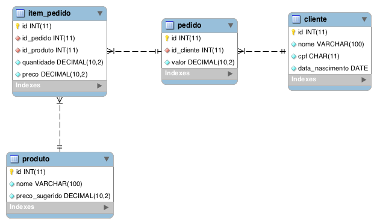

<<<<<<< HEAD


### Você gosta de encarar desafios e quer fazer parte de uma equipe que não para de crescer? Então, venha para o time!
### Complete o desafio abaixo para a gente conhecer mais sobre você:

Faça o Fork deste projeto e desenvolva uma **API REST em Java** com o modelo de dados abaixo. 
Assim que concluir, faça um Pull Request e mande seu currículo para <queroserpaguer@meupag.com.br> com o assunto **quero-ser-paguer-backend**. Caso seja aprovado, iremos entrar em contato com você.



> **PS:** fique à vontade para incluir outros conhecimentos. Cada item do bônus que você adicionar ao seu projeto contará para a sua avaliação.

### Bônus
- Spring boot
- Clean Code
- Teste Unitário
- Controle de acesso
- API Documentada
- Cache de segundo nível
- Database Migration
- Bean Validation
- Docker

### Bônus Master (AWS)
- Lambda
- RDS / DynamoDB
- API Gateway
- Cognito
- [Serverless Framework](https://serverless.com/)
=======
# PagBackend

**TODO: Add description**

## Installation

If [available in Hex](https://hex.pm/docs/publish), the package can be installed
by adding `pag_backend` to your list of dependencies in `mix.exs`:

```elixir
def deps do
  [
    {:pag_backend, "~> 0.1.0"}
  ]
end
```

Documentation can be generated with [ExDoc](https://github.com/elixir-lang/ex_doc)
and published on [HexDocs](https://hexdocs.pm). Once published, the docs can
be found at [https://hexdocs.pm/pag_backend](https://hexdocs.pm/pag_backend).

>>>>>>> dd00a727bde2b421ed5aea12f657ac5c758f5764
